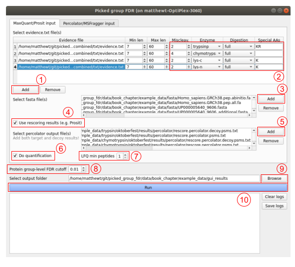

Basic usage
===========

Always make sure that you have run your database search with 100% protein-level FDR.
Instructions on how to do this are given in the respective search engine sections.

Users unfamiliar with the command line and Python are advised to use the :ref:`Graphical user interface (GUI)`.
For more flexibility, use the :ref:`Command line` or a :ref:`Python script / jupyter notebook`.

Graphical user interface (GUI)
------------------------------

Starting the GUI
^^^^^^^^^^^^^^^^

On Windows (no installation required):

1. Download and unzip the ``PickedGroupFDR_GUI_windows.zip`` from the `latest release <https://github.com/kusterlab/picked_group_fdr/releases>`__.
2. Double click on ``PickedGroupFDR.exe`` to start the GUI. It may take a few seconds for the GUI to open.

On all platforms (Windows, Linux, OSX, etc.):

1. :doc:`Install the Picked Group FDR Python package <installation>`.
2. Install ``PyQt5`` with ``pip``:

    .. code:: shell
        
        pip install PyQt5

3. Start the GUI with:

    .. code:: shell

        python gui.py

Using the GUI
^^^^^^^^^^^^^

The example below shows how to analyze the data downloadable from https://zenodo.org/records/10056025.

#. Select the evidence files.
#. If necessary, update the digestion parameters in the table.
#. Select the fasta file(s).
#. If using rescoring results from `Oktoberfest <https://github.com/wilhelm-lab/oktoberfest>`__

    #. check the ``Use rescoring results`` checkbox.
    #. Add the rescored PSM files generated by Oktoberfest.
#. Keep the ``Do quantification`` checkbox checked
#. Set the ``LFQ min peptides`` to 1.
#. Keep the ``Protein group-level FDR cutoff`` at 0.01, which corresponds to a 1% protein group-level FDR for the final proteinGroups.txt.
#. Specify the output directory.
#. Click on ``Run``.
#. The filtered protein group results can be found in the output directory specified in Step 8 in a file called proteinGroups.fdr1.txt.

Command line
------------

MaxQuant results
^^^^^^^^^^^^^^^^

1. :doc:`Install the Picked Group FDR Python package <installation>`.

2. Make sure that you have run the MaxQuant search with 100%
   protein-level FDR.

3. The posterior error probabilities (PEP) of MaxQuant are not
   well-calibrated. Therefore, we first recalculate these with
   `Mokapot <https://mokapot.readthedocs.io/en/latest/>`__
   (=\ `Percolator <http://percolator.ms/>`__ for Python):

   .. code:: shell

      python3 -u -m picked_group_fdr.pipeline.andromeda2pin </path/to/mq_evidence_txt> \
         --outputTab andromeda.tab \
         --databases </path/to/fasta_file>
      python3 -u -m picked_group_fdr.pipeline.run_mokapot 0.01 0.01 percolator <num_threads>
      python3 -u -m picked_group_fdr.pipeline.update_evidence_from_pout \
         --mq_evidence </path/to/mq_evidence_txt> \
         --perc_results percolator/andromeda.mokapot.psms.txt percolator/andromeda.mokapot.decoy.psms.txt \
         --mq_evidence_out percolator/evidence.txt

   Alternatively, you can use
   `Prosit <https://www.proteomicsdb.org/prosit/>`__\ ’s Percolator
   results files directly:

   .. code:: shell

      python3 -u -m picked_group_fdr.pipeline.update_evidence_from_pout \
         --mq_evidence </path/to/mq_evidence_txt> \
         --perc_results prosit_target.psms prosit_decoy.psms \
         --mq_evidence_out percolator/evidence.txt \
         --pout_input_type prosit

4. To obtain protein group level FDRs, run:

   .. code:: shell

      python -m picked_group_fdr \
         --mq_evidence percolator/evidence.txt \
         --fasta </path/to/fasta_file> \
         --method picked_protein_group_mq_input \
         --protein_groups_out percolator/proteinGroups.txt

Python script / jupyter notebook
--------------------------------

The PickedGroupFDR Python module exposes a number of convenient methods for calling the different tools inside a Python script. 
Here, this functionality is demonstrated using a Jupyter notebook available at https://github.com/kusterlab/picked_group_fdr/tree/main/data/book_chapter/coon_analysis.ipynb:

The example below shows how to analyze the data downloadable from https://zenodo.org/records/10056025.

#. Import the ``pipeline`` module of the PickedGroupFDR package, as well as the ``DigestionParams`` class. The ``pipeline`` module contains several methods for calling the different tools in PickedGroupFDR. The ``DigestionParams`` class provides a wrapper for all digestion parameters.
#. If using rescoring results from `Oktoberfest <https://github.com/wilhelm-lab/oktoberfest>`__, update the MaxQuant evidence files with the rescored PSMs from Oktoberfest using the ``run_update_evidence method``.
#. Process the (updated) evidence files with PickedGroupFDR using the ``run_picked_group_fdr`` method.
#. Filter the results at 1% FDR using the ``run_filter_fdr_maxquant`` method.
#. Open the filtered results with the Python ``pandas`` package.